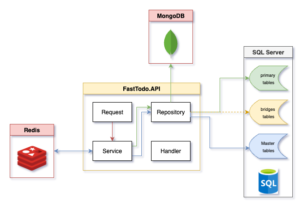

# todolist-net8-fastendpoint
A project demonstrating Clean Architecture with EF Core and ASP.NET Core using FastEndpoints

Table of Contents
=======
* [Technologies & Patterns](#technologies--patterns)
* [Features](#features)
* [API Endpoints](#api-endpoints)
* [Getting Started](#getting-started)
* [Configuration](#configuration)

## Technologies & Patterns
### Architecture

<p align='center'>
   
</p>

### Database Providers
- SQL Server
- SQLite
- Postgres
- [Coming soon] MariaDB
- [Coming soon] MongoDB

### Backend Stack
- .NET `8.0`
- [FastEndpoints](https://fast-endpoints.com/) `5.34.0`
- [Entity Framework Core](https://learn.microsoft.com/en-us/ef/core/) `9.0.0`
- [MediatR](https://github.com/jbogard/MediatR) `12.4.1`
- [FluentValidation](https://docs.fluentvalidation.net/en/latest/) `12.0.0`

### Patterns
- Generic Repository Pattern with Unit of Work
- CQRS Pattern with MediatR
- [Coming soon] Option pattern

## Features
### Completed ✅
1. Basic Todo Operations
    - Create, Read, Update, Delete (CRUD)
    - List all items with filtering
    - Get item by ID
2. Input Validation using FluentValidation
3. Data Seeding Console Application
4. Generic Repository Pattern Implementation
5. Multiple Database Provider Support (SQL Server, SQLite)
6. API Versioning
7. Unit of Work Pattern
8. Dockerization
9. Logging

### In Progress 🚧
1. ASP.NET Core Identity Integration
2. User Management
    - Implement ASP.NET Core Identity login using JWT
    - User Authentication
    - Todo Item Ownership
    - Todo Item Assignment

### Planning 📋
1. Options Pattern
2. Allow multiple database connection from multiple database providers
2. Testing
3. Azure Container integration

## API Endpoints

| Method | Endpoint        | Description                           |
|--------|----------------|---------------------------------------|
| GET    | /api/todos     | Get all todos with optional filtering |
| GET    | /api/todos/{id}| Get a specific todo by ID            |
| POST   | /api/todos     | Create a new todo                    |
| PUT    | /api/todos/{id}| Update an existing todo             |
| PATCH  | /api/todos/{id}| Update todo status             |
| DELETE | /api/todos/{id}| Delete a todo                       |

## Getting Started

### Prerequisites
- [.NET 8.0 SDK](https://dotnet.microsoft.com/en-us/download/dotnet/8.0)
- [Docker](https://www.docker.com/) or [Podman](https://podman.io/)

Setup `docker containers` in [Getting started](https://github.com/p3t3r276/todolist-net8-fastendpoint/blob/dev/docker/Readme.md)

### Configuration
The database provider can be configured in `appsettings.json`:
```json
{
  "ConnectionStrings": {
    "Sqlite": "Data Source=FastTodo.db",
    "SqlServer": "",
    "Postgres": ""
  },
  "SqlProvider": "SQLServer"
}
```
