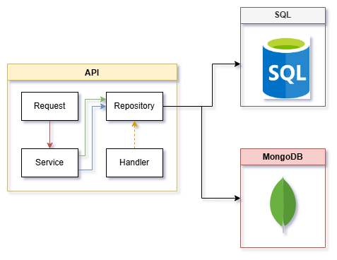

# todolist-net8-fastendpoint
A project demonstrating Clean Architecture with EF Core and ASP.NET Core using FastEndpoints

Table of Contents
=======
* [Technologies & Patterns](#technologies--patterns)
* [Solution Structure](#solution-structure)
* [Features plan](#features)
* [API Endpoints](#api-endpoints)
* [Getting Started](#getting-started)
* [Configuration](#configuration)

## Technologies & Patterns
### Architecture

<p align='center'>
  
</p>

### Database structure

<p align='center'>
  
</p>

### Database Providers
- SQL Server
- SQLite
- Postgres
- MariaDB
- [Coming soon] Redis
- [Coming soon] MongoDB

### Backend Stack
- [.NET](https://dotnet.microsoft.com/en-us/download/dotnet/8.0) `8.0`
- [FastEndpoints](https://fast-endpoints.com/) `5.34.0`
- [Entity Framework Core](https://learn.microsoft.com/en-us/ef/core/) `9.0.0`
- [MediatR](https://github.com/jbogard/MediatR) `12.4.1`
- [FluentValidation](https://docs.fluentvalidation.net/en/latest/) `12.0.0`

### Patterns
- Generic Repository Pattern with Unit of Work
- CQRS Pattern with MediatR
- Option pattern

## Solution Structure

| Project | Responsibility |
|---------|---------------|
| FastTodo.API | Main entry point. Handles HTTP requests, configures services, and manages API endpoints using FastEndpoints |
| FastTodo.Application | Contains application business logic, CQRS handlers, validations, and mapping profiles |
| FastTodo.Domain | Core domain entities, interfaces, and business rules. No external dependencies |
| FastTodo.Domain.Shared | Shared constants, enums, and utility classes used across all layers |
| FastTodo.Infrastructure | Cross-cutting concerns: data access, logging, caching, authentication |
| FastTodo.Infrastructure.Domain | Interfaces and base classes for infrastructure services |
| FastTodo.Persistence.EF | Entity Framework Core implementations for SQL Server |
| FastTodo.Persistence.SQLite | SQLite specific database context and configurations |
| FastTodo.Persistence.Postgres | PostgreSQL specific database context and configurations |
| FastTodo.SeedData | Console application for seeding sample data into the database |

## Features
### ✅ Completed 
1. Basic Todo Operations
    - Create, Read, Update, Delete (CRUD)
    - List all items with filtering
    - Get item by ID
2. Input Validation using FluentValidation
3. Data Seeding Console Application
4. Generic Repository Pattern Implementation
5. Multiple Database Provider Support (SQL Server, SQLite)
6. API Versioning
7. Unit of Work Pattern
8. Dockerization
9. Logging
10. ASP.NET Core Identity Integration
11. Options Pattern
    - Allow choosing database providers
12. User Management
    - Implement ASP.NET Core Identity login using JWT
    - User Authentication
    - Todo Item Ownership

### 🚧 In Progress 
1. User Management 
    - Todo Item Assignment

### 📋 Planning 
1. Options Pattern
    - Swagger vs Scalar
2. Allow multiple database connection from multiple database providers
3. Caching with Redis
4. MongoDB Integration
5. Integrate CAP
6. RabbitMQ Integration
6. Unit Test
7. Azure Container integration

## API Endpoints

### Todo Operations

| Method | Endpoint        | Description                           |
|--------|----------------|---------------------------------------|
| GET    | /api/todos     | Get all todos with optional filtering |
| GET    | /api/todos/{id}| Get a specific todo by ID            |
| POST   | /api/todos     | Create a new todo                    |
| PUT    | /api/todos/{id}| Update an existing todo             |
| PATCH  | /api/todos/{id}| Update todo status                  |
| DELETE | /api/todos/{id}| Delete a todo                       |

### Authentication & User Management

| Method | Endpoint                    | Description                          |
|--------|----------------------------|--------------------------------------|
| POST   | /api/accounts/register     | Register a new user                 |
| POST   | /api/accounts/login        | Login and get JWT token             |
| POST   | /api/accounts/refresh      | Refresh JWT token                   |
| POST   | /api/accounts/logout       | Logout and invalidate token         |
| GET    | /api/accounts/info         | Get current user info               |
| PUT    | /api/accounts/info         | Update user profile                 |
| PUT    | /api/accounts/password     | Change password                     |
| POST   | /api/accounts/confirmemail | Confirm email address               |
| POST   | /api/accounts/resetpassword| Reset forgotten password            |

## Getting Started

### Prerequisites
- [.NET 8.0 SDK](https://dotnet.microsoft.com/en-us/download/dotnet/8.0)
- [Docker](https://www.docker.com/) or [Podman](https://podman.io/)

Setup `docker containers` in [Docker documentation](https://github.com/p3t3r276/todolist-net8-fastendpoint/blob/dev/docker/Readme.md)

### Configuration
The database provider can be configured in `appsettings.json`:

```jsonc
{
"ConnectionStrings": {
    "Default": "",
    "Identity": ""
  },
  "fastTodoOption": {
    "SQLProvider": "", // Postgres, SQLite or SQLServer
    "noSql": "",
    "openapi": "swagger" // swagger or scalar
  },
}
```
